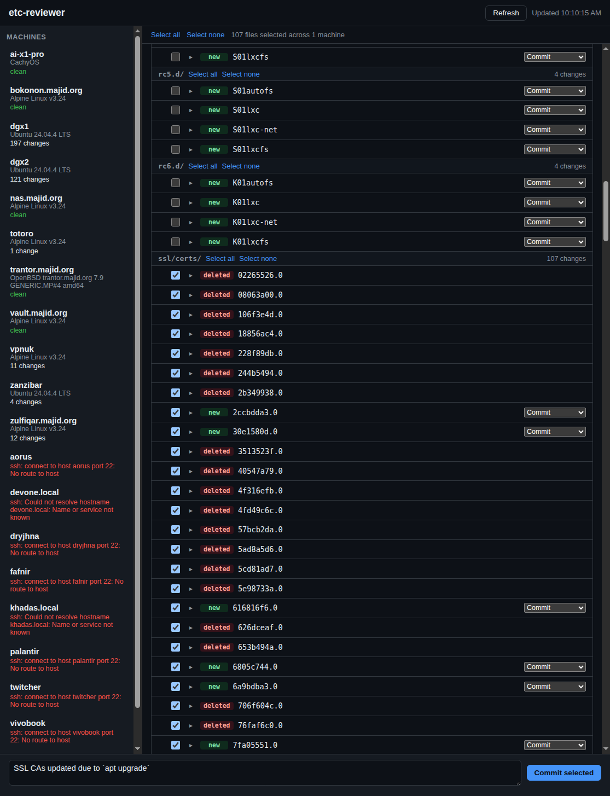

# etc-reviewer

A small local web tool for reviewing and committing `/etc` changes across a
fleet of machines that each keep `/etc` under git (e.g. via `etckeeper init`,
without relying on its autocommit cron job).

It SSHes to each machine as `root`, runs `git status` in `/etc`, and shows
every machine's uncommitted changes consolidated in one page so you can
pick exactly which changes to commit, with what message, and review diffs
before committing.



## Setup

```
pip install -r requirements.txt
cp machines.txt my-machines.txt   # or just edit machines.txt in place
```

Edit `machines.txt` (or your own copy) with one hostname per line — these
are used both as the SSH target (`ssh root@<hostname>`) and as the initial
display name (replaced with the machine's actual `hostname` once it
responds). Lines starting with `#` are ignored.

This relies entirely on your existing SSH setup (agent, keys, `~/.ssh/config`)
to authenticate as `root` on each host — set that up first with plain
`ssh root@host` if it doesn't already work passwordlessly.

## Run

```
python3 run.py
```

This starts a Flask server on `http://127.0.0.1:5757/` and opens it in your
browser. Useful flags:

```
python3 run.py --machines-file my-machines.txt --port 6001 --no-browser
```

## What it does

- Queries all configured machines in parallel over SSH, showing each
  machine's hostname, OS (from `/etc/os-release`, falling back to `uname -a`),
  and reachability/error status in the left panel.
- Lists every uncommitted change (`git status --porcelain`) across all
  machines, grouped by machine, each with a checkbox and a disclosure arrow
  that lazily fetches and shows the diff for that file.
- For newly added (untracked) files, each row has a Commit / Add to
  .gitignore choice — picking "Add to .gitignore" appends the path to
  `/etc/.gitignore` on that machine and folds that into the commit instead
  of committing the file itself.
- Typing a commit message and clicking "Commit selected" commits exactly
  the checked files (only those paths — nothing else that might happen to
  be staged) on every machine that has a checked file, using that same
  message, then refreshes.

## Notes / limitations

- No password prompts are handled (`BatchMode=yes`); SSH auth must already
  work non-interactively as root.
- Host key verification is left entirely to your normal `ssh` configuration
  (e.g. `~/.ssh/config`, `known_hosts`, certificate authorities). Nothing
  here overrides `StrictHostKeyChecking`, so an unrecognized or changed
  host key fails the connection instead of being silently accepted; that
  machine will just show up as unreachable, with the SSH error as the
  reason, until you resolve it through your usual process.
- This is a single-user local tool: the server binds to `127.0.0.1` only,
  with no authentication of its own, since anyone who can reach it can push
  root-level git commits to every configured machine.
